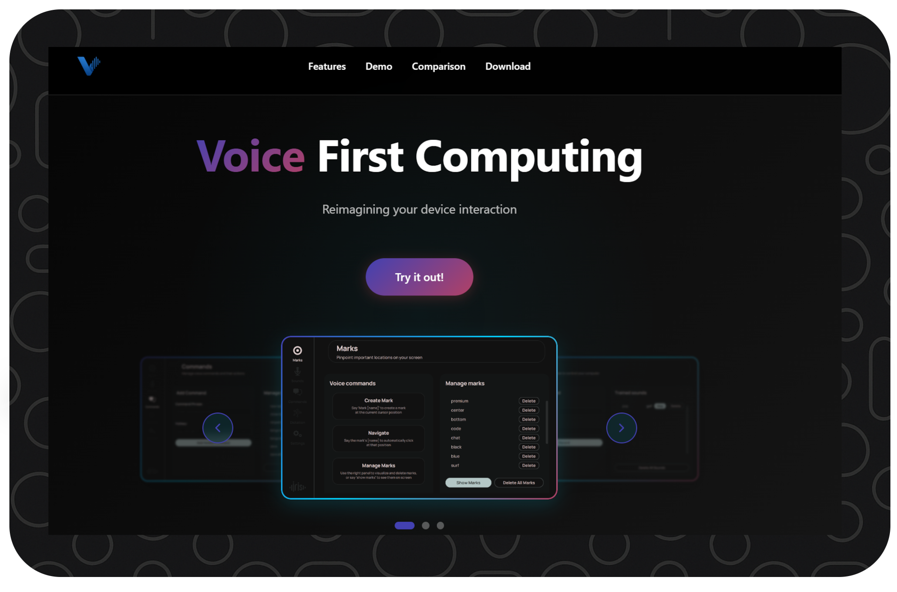

<div style="width:100%; display:flex; justify-content:center;">
  
</div>

<!-- TODO: update links: -->
<div align="center">
  <a href="https://vocalance.com">Website</a> |
  <a href="https://vocalance.readthedocs.io/en/latest/developer/introduction.html">Documentation</a> |
  <a href="https://vocalance.readthedocs.io/en/latest/contact.html">Contact</a>
</div>


## 💡 Overview
[](https://app.fossa.com/projects/git%2Bgithub.com%2Frick12000%2Fvocalance?ref=badge_shield)


Vocalance offers hands free control of your computer, enabling you to switch tabs, move on screen, dictate anywhere and much more!

## 🚀 Website

To find out more about what Vocalance can do, including detailed instructions and guides, refer to the [official website](https://vocalance.com):

<div style="width:100%; display:flex; justify-content:center;">
  
</div>


## 💻 Installation

Vocalance can be set up entirely from the source code in this repository. To do so, follow the instructions below:

### Steps

1. **Clone the repository:**
   ```bash
   git clone https://github.com/rick12000/vocalance.git
   ```

2. **Create a Python 3.11.0 environment using your environment manager of choice. Then with that environment activated:**

    - **Go to the repository directory:**
      ```bash
      cd vocalance
      ```

    - **Install Vocalance as a package locally:**
      ```bash
      pip install .
      ```

    - **Run the application:**
        ```bash
        python vocalance.py
        ```

The application will start up and download any required models (like speech recognition models) on first run. This may take several minutes depending on your internet connection.

On follow up runs, skip the `pip install .` step and just run the application (in the environment you created earlier).

If you haven't already, refer to Vocalance's official website for [instructions](https://rick12000.github.io/vocalance-launch-site/instructions.html).

## 🔧 System Requirements

- **Operating System**: Windows 10/11 (macOS and Linux support planned)
- **RAM**: 2GB RAM
- **Disk**: 5GB
- **Hardware**: It is **strongly** recommended to purchase a reasonably good headset or microphone to improve Vocalance outputs and recognition, but it will still work without this.

## 🤝 Contributing

Reach out at vocalance.contact@gmail.com with title **"Contribution"** if:

- You have software engineering experience and have feedback on how the architecture of the application could be improved.
- You want to add an original or pre-approved feature.

For now, contributions will be handled on an ad-hoc basis, but in future contribution guidelines will be set up depending on the number of contributors.

## 📚 Technical Documentation

If you want to find out more about Vocalance's architecture, refer to the technical documentation pages:

- **[Developer Introduction](https://vocalance.readthedocs.io/en/latest/developer/introduction.html)** - Brief overview of the main architecture and component flow
- **[Audio Processing](https://vocalance.readthedocs.io/en/latest/developer/audio_capture_and_listeners.html)** - Audio capture and speech recognition
- **[Command System](https://vocalance.readthedocs.io/en/latest/developer/command_parsing.html)** - Command parsing and execution
- **[Dictation](https://vocalance.readthedocs.io/en/latest/developer/dictation_system.html)** - Transcription and formatting
- **[User Interface](https://vocalance.readthedocs.io/en/latest/developer/user_interface.html)** - UI components and interactions
- **[Infrastructure](https://vocalance.readthedocs.io/en/latest/developer/event_bus_and_infrastructure.html)** - Event bus and service communication


## 📈 Upcoming Features

The following features are planned additions to Vocalance, with some in early development and others under consideration:

*   **Eye Tracking for Cursor Control:** This feature is planned to enable cursor control via eye movements.
    *   **Gaze Tracking Accuracy:** Merge gaze tracking with historical screen click data and screen contents to improve accuracy, aiming for good performance even with webcam tracking.
    *   **Zoom Option:** Add a zoom option to better direct gaze on screen contents.

*   **Context-Aware Commands:** Implement context bucketing for commands, allowing the same command phrase (e.g., "previous") to map to different hotkeys depending on the active application (e.g., VSCode vs. Chrome). This aims to avoid disambiguation phrases.

*   **LLM-Powered Text Refactoring:** Ability to select any text and reformat it via an LLM by speaking a prompt.

*   **Improved Text Editing & Navigation:** Further enhancements to text editing and text navigation tools.

*   **Enhanced Predictive Features:** Improve predictive capabilities based on window contents, recent context, gaze patterns, and more.
    *   *Privacy Note:* Any feature requiring local storage of potentially sensitive data (e.g., screenshots, window contents) will be deployed as an opt-in feature and disabled by default.


## License
[](https://app.fossa.com/projects/git%2Bgithub.com%2Frick12000%2Fvocalance?ref=badge_large)