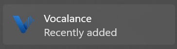

<div style="width:100%; display:flex; justify-content:center;">
  
</div>

<div align="center">
  <a href="https://vocalance.com">Website</a> |
  <a href="https://vocalance.readthedocs.io/en/latest/developer/overview/introduction.html">Documentation</a> |
  <a href="https://vocalance.readthedocs.io/en/latest/contact.html">Contact</a>
</div>


## 💡 Overview

Vocalance offers hands free control of your computer, enabling you to switch tabs, move on screen, dictate anywhere and much more!

## 🚀 Website

To find out more about what Vocalance can do, including detailed instructions and guides, refer to the [official website](https://vocalance.com):

<div style="width:100%; display:flex; justify-content:center;">
  
</div>


## 💻 Installation

Vocalance can be set up entirely from the source code in this repository (currently only supported on Windows).

### ✨ **Easy Setup (Recommended)**

> [!IMPORTANT]
> If you want to enable AI features, ensure [Microsoft C++ Build Tools](https://visualstudio.microsoft.com/visual-cpp-build-tools/) are installed — download the installer, run it, and tick "**Desktop development with C++**" under workloads.

To get started with installation, either follow the steps below or watch the [installation walkthrough on YouTube](https://www.youtube.com/watch?v=p2_gPICZ9x8).

1. Open PowerShell (from Windows Start Menu).

2. Paste and run:

    ```powershell
    Invoke-WebRequest -Uri "https://raw.githubusercontent.com/rick12000/vocalance/main/scripts/bootstrapping/setup.ps1" -OutFile "vocalance-setup.ps1"; powershell -ExecutionPolicy Bypass -File .\vocalance-setup.ps1
    ```

   *If you'd like to inspect what the script will do before running it, view [scripts/bootstrapping/setup.ps1](scripts/bootstrapping/setup.ps1) in this repository.*

   During setup you will be asked whether to enable LLM features. Answer **yes** if you want to enable AI dictation and AI text editing functionality, otherwise answer **no**.

3. Open Vocalance from the Start Menu (search "vocalance" if not featured):

<p align="center">
  
</p>

   - If the application doesn't appear immediately after you clicked it, *wait 10-15 seconds before retrying*, it may be loading in the background.
   - If you enabled LLM features, the application needs to **download** your local AI model from a trusted *Hugging Face* repository on first use. **Do not close** the startup window during this process — allow up to 30 minutes depending on your internet connection (around 5 minutes for most users).

Then you're good to go! If you haven't already, refer to Vocalance's official website for [instructions](https://rick12000.github.io/vocalance-launch-site/instructions.html) on how everything works.

Having issues with the installation steps? Reach out at: vocalance.contact@gmail.com

---

### 🛠️ **Developer Setup**

> [!IMPORTANT]
> If you want to enable AI features, ensure [Microsoft C++ Build Tools](https://visualstudio.microsoft.com/visual-cpp-build-tools/) are installed — download the installer, run it, and tick "**Desktop development with C++**" under workloads. Then install with `uv sync --extra llm` instead of `uv sync --active`.

#### 1. Set Up UV

1. Open Windows PowerShell and enter the script below to install [UV](https://github.com/astral-sh/uv) (Python package manager):
   ```powershell
   powershell -ExecutionPolicy ByPass -c "irm https://astral.sh/uv/install.ps1 | iex"
   ```

2. Add UV to path (this is specific to this terminal session only, repeat this step every time, or add to permanent path to skip):
   ```powershell
   $env:Path = "$HOME\.local\bin;$env:Path"
   ```

#### 2. Set Up Vocalance

1. Create a 3.13.9 virtual environment named `vocalance_env` with UV:
   ```bash
   uv venv --python 3.13.9 vocalance_env
   ```

2. Activate the environment:
   ```bash
   vocalance_env\Scripts\activate
   ```

3. Clone the repository:
   ```bash
   git clone https://github.com/rick12000/vocalance.git
   ```

4. Go to the repository directory:
   ```bash
   cd vocalance
   ```

5. Install Vocalance from `uv.lock`:
   ```bash
   uv sync --active
   ```

   To include LLM features (smart dictation, text-amend), install with:
   ```bash
   uv sync --active --extra llm
   ```

6. Run the application:
   ```bash
   python vocalance.py
   ```

The application will start up and download any required models (like speech recognition models) on first run. If LLM features are enabled, the local AI model is also downloaded on first launch. This may take several minutes depending on your internet connection.

Then you're good to go! If you haven't already, refer to Vocalance's official website for [instructions](https://rick12000.github.io/vocalance-launch-site/instructions.html) on how to get started.


### An Aside on Pip

The recommended approach is to install Vocalance with uv, since the developers can freeze and document all recommended dependancies in a `uv.lock` file, which you then install with `uv sync --active`.

If you're more familiar with a mixture of a virtual environment manager (eg. `venv` or `conda` or `pyenv`) + `pip` however, you can absolutely replace above uv steps with your environment manager and replace `uv sync --active` with `pip install .` to install Vocalance as a package. Note this is at your discretion, and license disclosures in this repository pertain to pinned package versions in `uv.lock`.

### 🧹 Cleanup

Run [scripts/bootstrapping/cleanup.ps1](https://github.com/rick12000/vocalance/blob/main/scripts/bootstrapping/cleanup.ps1) to uninstall Vocalance completely:

```powershell
powershell -ExecutionPolicy Bypass -File .\cleanup.ps1
```

This removes the application files (`%LOCALAPPDATA%\Programs\Vocalance\`), user data (`%APPDATA%\vocalance_voice_assistant_data\`), and the Start Menu shortcut. It does not remove system-level tools such as UV.


## ⚠️ Disclaimers

Vocalance is distributed under a GPLv3 license. It makes use of your microphone and, at startup, downloads required assets (such as AI models or text to speech models) from the internet. For a full set of disclaimers and usage warnings, refer to the [disclaimer notes](DISCLAIMER.md).

## 🔧 System Requirements

- **Operating System**: Windows 10/11 (macOS and Linux support planned)
- **RAM**: 2GB RAM
- **Disk**: 5GB
- **Hardware**: It is **strongly** recommended to purchase a reasonably good headset or microphone to improve Vocalance outputs and recognition, but it will still work without this.

## 🤝 Contributing

Reach out at vocalance.contact@gmail.com with title **"Contribution"** if:

- You have software engineering experience and have feedback on how the architecture of the application could be improved.
- You want to add an original or pre-approved feature.

For now, contributions will be handled on an ad-hoc basis, but in future contribution guidelines will be set up depending on the number of contributors.

## 📚 Technical Documentation

If you want to find out more about Vocalance's architecture, refer to the technical documentation on [Read the Docs](https://vocalance.readthedocs.io/en/latest/developer/overview/introduction.html):

- **[Overview](https://vocalance.readthedocs.io/en/latest/developer/overview/introduction.html)** — End-to-end architecture, the audio pipeline, and how capture, command flow, and dictation relate
- **[Capture](https://vocalance.readthedocs.io/en/latest/developer/features/capture.html)** — Microphone capture, `AudioCaptureService`, and how audio reaches the rest of the app
- **[Command flow](https://vocalance.readthedocs.io/en/latest/developer/features/command_flow.html)** — Segmenting, recognition, parsing, and executing voice commands as OS actions
- **[Dictation flow](https://vocalance.readthedocs.io/en/latest/developer/features/dictation_flow.html)** — Long-running dictation sessions, recognizers, and typing pipeline
- **[User interface](https://vocalance.readthedocs.io/en/latest/developer/features/user_interface.html)** — How pipeline events reach the screen and how UI input returns to the bus
- **[Event bus](https://vocalance.readthedocs.io/en/latest/developer/foundations/event_bus.html)** — Publish/subscribe model, dispatch, and how services stay decoupled


## 📈 Upcoming Features

The following features are planned additions to Vocalance, with some in early development and others under consideration:

*   **Eye Tracking for Cursor Control:** This feature is planned to enable cursor control via eye movements.
    *   **Gaze Tracking Accuracy:** Merge gaze tracking with historical screen click data and screen contents to improve accuracy, aiming for good performance even with webcam tracking.
    *   **Zoom Option:** Add a zoom option to better direct gaze on screen contents.

*   **Context-Aware Commands:** Implement context bucketing for commands, allowing the same command phrase (e.g., "previous") to map to different hotkeys depending on the active application (e.g., VSCode vs. Chrome). This aims to avoid disambiguation phrases.

*   **Improved Text Editing & Navigation:** Further enhancements to text editing and text navigation tools.

*   **Enhanced Predictive Features:** Improve predictive capabilities based on window contents, recent context, gaze patterns, and more.
    *   *Privacy Note:* Any feature requiring local storage of potentially sensitive data (e.g., screenshots, window contents) will be deployed as an opt-in feature and disabled by default.
