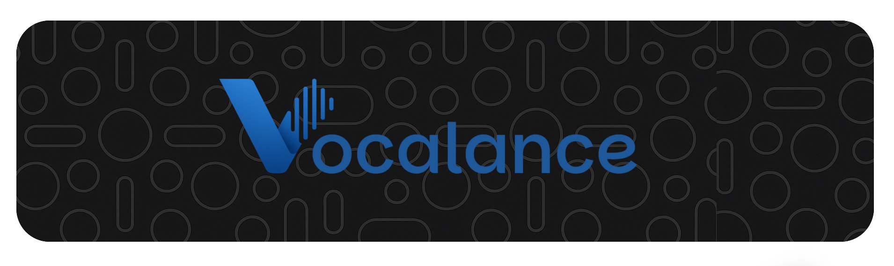
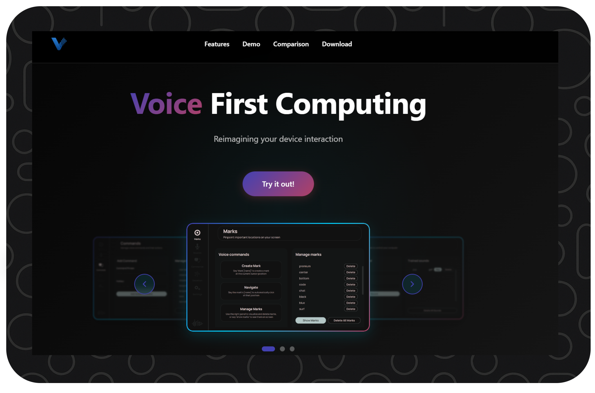

<div style="width:100%; display:flex; justify-content:center;">
  
</div>

<div align="center">
  <a href="https://vocalance.com">Website</a> |
  <a href="https://vocalance.readthedocs.io/en/latest/developer/introduction.html">Documentation</a> |
  <a href="https://vocalance.readthedocs.io/en/latest/contact.html">Contact</a>
</div>


## 💡 Overview

Vocalance offers hands free control of your computer, enabling you to switch tabs, move on screen, dictate anywhere and much more!

## 🚀 Website

To find out more about what Vocalance can do, including detailed instructions and guides, refer to the [official website](https://vocalance.com):

<div style="width:100%; display:flex; justify-content:center;">
  
</div>


## 💻 Installation

Vocalance can be set up entirely from the source code in this repository (currently only supported on Windows).

### ✨ **Easy Setup**

> [!IMPORTANT]
> **Requirement:** Ensure Git is installed. If not, download the latest Git for Windows from [git-scm.com/download/win](https://git-scm.com/download/win).

1. Open PowerShell (from Windows Start Menu).

2. Paste and run:

    ```powershell
    Invoke-WebRequest -Uri "https://raw.githubusercontent.com/rick12000/vocalance/main/scripts/bootstrapping/setup.ps1" -OutFile "vocalance-setup.ps1"; powershell -ExecutionPolicy Bypass -File .\vocalance-setup.ps1
    ```

   What the script does:
   - Clones the repository
   - Creates or recreates the `vocalance_env` virtual environment
   - Installs dependencies from the locked manifest
   - Creates a Start Menu shortcut to launch Vocalance (no console)

   If you'd like to inspect what the script will do before running it, view [scripts/bootstrapping/setup.ps1](scripts/bootstrapping/setup.ps1) in this repository.

3. Open Vocalance from the Start menu.

### 🛠️ **Developer Setup**

#### 1. Set Up UV

1. Open Windows PowerShell and enter the script below to install [UV](https://github.com/astral-sh/uv) (Python package manager):
   ```powershell
   powershell -ExecutionPolicy ByPass -c "irm https://astral.sh/uv/install.ps1 | iex"
   ```

2. Add UV to path (this is specific to this terminal session only, repeat this step every time, or add to permanent path to skip):
   ```powershell
   $env:Path = "$HOME\.local\bin;$env:Path"
   ```

#### 2. Set Up Vocalance

1. Create a 3.13.9 virtual environment named `vocalance_env` with UV:
   ```bash
   uv venv --python 3.13.9 vocalance_env
   ```

2. Activate the environment:
   ```bash
   vocalance_env\Scripts\activate
   ```

3. Clone the repository:
   ```bash
   git clone https://github.com/rick12000/vocalance.git
   ```

4. Go to the repository directory:
   ```bash
   cd vocalance
   ```

5. Install Vocalance from `uv.lock`:
   ```bash
   uv sync --active
   ```

6. Run the application:
   ```bash
   python vocalance.py
   ```

The application will start up and download any required models (like speech recognition models) on first run (these are downloaded from Hugging Face or other reputable hosts). This may take several minutes depending on your internet connection.

Then you're good to go! If you haven't already, refer to Vocalance's official website for [instructions](https://rick12000.github.io/vocalance-launch-site/instructions.html) on how to get started.

#### 3. Reopen Vocalance

If you want to reopen Vocalance after you closed it, you can repeat above steps, but skipping all installation steps.

Specificaly, open a new Windows PowerShell window and enter the following chained commands (taken from set up section):

```bash
$env:Path = "$HOME\.local\bin;$env:Path"; vocalance_env\Scripts\activate; cd vocalance; python vocalance.py
```

This will start Vocalance.

### An Aside on Pip

The recommended approach is to install Vocalance with uv, since the developers can freeze and document all recommended dependancies in a `uv.lock` file, which you then install with `uv sync --active`.

If you're more familiar with a mixture of a virtual environment manager (eg. `venv` or `conda` or `pyenv`) + `pip` however, you can absolutely replace above uv steps with your environment manager and replace `uv sync --active` with `pip install .` to install Vocalance as a package. Note this is at your discretion, and license disclosures in this repository pertain to pinned package versions in `uv.lock`.

**Maintainers — PyPI license fetch:** From the repo root, run `python scripts/licensing/fetch_licenses.py` (see [scripts/licensing/fetch_licenses.py](scripts/licensing/fetch_licenses.py)) to refresh `NOTICES/PYPI_LICENSES`.

## 🔧 System Requirements

- **Operating System**: Windows 10/11 (macOS and Linux support planned)
- **RAM**: 2GB RAM
- **Disk**: 5GB
- **Hardware**: It is **strongly** recommended to purchase a reasonably good headset or microphone to improve Vocalance outputs and recognition, but it will still work without this.

## 🤝 Contributing

Reach out at vocalance.contact@gmail.com with title **"Contribution"** if:

- You have software engineering experience and have feedback on how the architecture of the application could be improved.
- You want to add an original or pre-approved feature.

For now, contributions will be handled on an ad-hoc basis, but in future contribution guidelines will be set up depending on the number of contributors.

## 📚 Technical Documentation

If you want to find out more about Vocalance's architecture, refer to the technical documentation pages:

- **[Developer Introduction](https://vocalance.readthedocs.io/en/latest/developer/introduction.html)** - Brief overview of the main architecture and component flow
- **[Audio Processing](https://vocalance.readthedocs.io/en/latest/developer/audio_capture_and_listeners.html)** - Audio capture and speech recognition
- **[Command System](https://vocalance.readthedocs.io/en/latest/developer/command_parsing.html)** - Command parsing and execution
- **[Dictation](https://vocalance.readthedocs.io/en/latest/developer/dictation_system.html)** - Transcription and formatting
- **[User Interface](https://vocalance.readthedocs.io/en/latest/developer/user_interface.html)** - UI components and interactions
- **[Infrastructure](https://vocalance.readthedocs.io/en/latest/developer/event_bus_and_infrastructure.html)** - Event bus and service communication


## 📈 Upcoming Features

The following features are planned additions to Vocalance, with some in early development and others under consideration:

*   **Eye Tracking for Cursor Control:** This feature is planned to enable cursor control via eye movements.
    *   **Gaze Tracking Accuracy:** Merge gaze tracking with historical screen click data and screen contents to improve accuracy, aiming for good performance even with webcam tracking.
    *   **Zoom Option:** Add a zoom option to better direct gaze on screen contents.

*   **Context-Aware Commands:** Implement context bucketing for commands, allowing the same command phrase (e.g., "previous") to map to different hotkeys depending on the active application (e.g., VSCode vs. Chrome). This aims to avoid disambiguation phrases.

*   **Improved Text Editing & Navigation:** Further enhancements to text editing and text navigation tools.

*   **Enhanced Predictive Features:** Improve predictive capabilities based on window contents, recent context, gaze patterns, and more.
    *   *Privacy Note:* Any feature requiring local storage of potentially sensitive data (e.g., screenshots, window contents) will be deployed as an opt-in feature and disabled by default.
